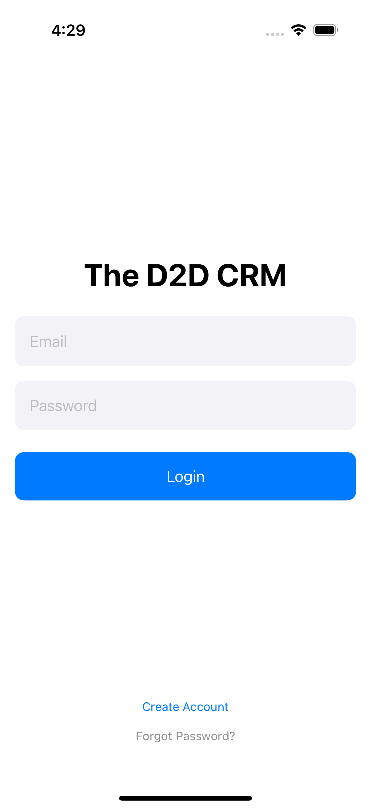

# D2D CRM

## Introducing A Sneak Peak Of The D2D CRM

  
  

## How to Turn Field Data Into Deals

**D2D CRM** is a free, open-source customer relationship management system built specifically for door-to-door sales reps using iOS 18 and above. It's designed to help reps manage prospects, track knocks, and follow up with leads — all while on the move.

---

## Why Build This?

A service is about helping someone — and in this case, helping sales reps do their job better.

What does that mean for a door-to-door rep?

- Managing leads while knocking doors
- Tracking prospects and their status
- Logging and reviewing knock history
- Saving time while improving follow-up

That’s what this CRM aims to deliver.

---

## The 3 Core Services

### 1. Map Service

Every day starts with deciding where to go. A map helps reps:

- Find their next area
- See which homes were knocked before
- Log knocks directly from the map view

It’s the first and most important tool in the app. Without a map, it’s impossible to organize territory or track progress.

### 2. Prospect Management

Once you talk to someone at the door, you need to remember the conversation.

This service allows reps to:

- Save addresses and contact names
- Add notes and follow-up details
- Keep track of every prospect over time

This is especially helpful for medium-difficulty leads — the ones that convert with just a bit more attention.

### 3. Backend Service (Data Glue)

To tie it all together, this CRM uses a backend data model to connect the Map and Prospect systems.

When you log a knock on the map, it shows up in the prospect’s record. When you update a prospect’s knock history, it affects how it appears on the map.

This structure creates a smooth user experience where everything works together without manual syncing.

---

## Why iOS Only?

Most reps use iPhones. Instead of trying to build for both platforms and doing a mediocre job, this project focuses on doing one platform well.

iOS also offers strong developer tools and a consistent environment for creating fast, reliable apps.

---

## Why Mobile Only?

Reps aren’t at desks. They’re outside.

That means software has to:

- Be quick to use
- Work offline
- Require minimal input
- Deliver fast feedback

This CRM is designed with mobile-first principles to support reps in the field, not slow them down.

---

## Features

- Email and password login
- Map-based address search
- Prospect management table
- Knock tracking with status
- Local storage via SwiftData and SQLite
- Designed for speed and simplicity

---

## Screenshots

Below is a preview of the login screen used to access the CRM.

  

---

## Requirements

- iOS 18 or later
- Xcode 16 or later
- SwiftData
- MapKit

---

## Contributor's Guide

### Clone the Repository

`git clone https://github.com/yourusername/d2d-crm-ios.git`

### Run UI Test for Screenshots

Before pushing to main, make sure the login screen screenshot is up to date.

    1.    Open the Xcode project (.xcodeproj or .xcworkspace).
    2.    Select the scheme: d2d-map-serviceUITests.
    3.    Choose a compatible iOS 18.4+ simulator (e.g., iPhone 16 Pro).
    4.    Run the UI test named testLoginScreenScreenshot in d2d_map_serviceUITests.swift.
    5.    After the test completes, check that the following file was updated: media/login-screen-screenshot.png
    6.    Commit the screenshot 
    
## How To Commit To The D2D CRM

`git add media/login-screen-screenshot.png`
`git commit -m "📸 Update login screen screenshot"`
`git push origin your-branch`
